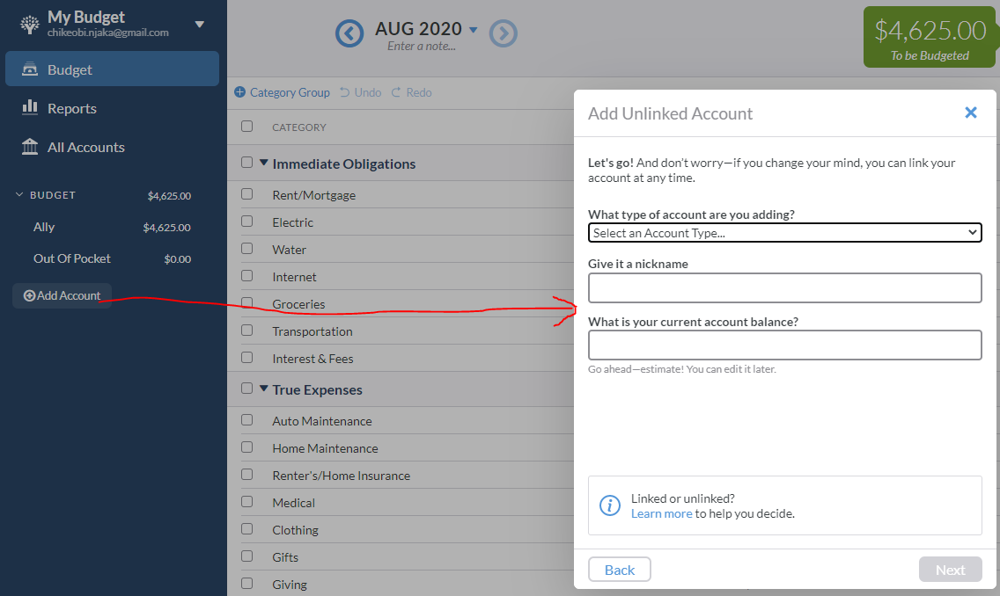

# Yet-Another-Budgetting-App (YABA) API Documentation

### Introduction
YABA API is based on JSON principles. The follwoing documentation covers core resources that are used to access and manipulate data in the YABA server.

### Reference

## <u>User</u>
This is a section of resources related to user access to the application

See this [link](https://www.tablesgenerator.com/markdown_tables#) for how to generate markdown table
| 
**Method**
   | 
**Path**
     | 
**Keys**
     | 
**Return**
                           | 
**Comment**
  |
|-----------------------------  |---------------------------    |---------------------------    |------------------------------------------------------ |------------------------------ |
| POST                          | /api/user/login               | [email, password]             | [status, message,[sessionUUID, firstName, lastname]]  |                               |
| POST                          | /api/user/logout              | [sessionUUID]                 | [status, message]                                     |                               |
| POST                          | /api/user/register            | [firstName, lastName, email, password] | [status, message]                            | Verification email is sent    |          
| GET                           | /api/user/verify/:verifyCode  | [  ]                            | ``<HTML response>``                                                | Verification email link       |
|                               |                               |                               |                                                       |                               |

* ### Login
> Matches with /api/user/login
> Login route. Success will return the following object:
>
>  - status: OK
>  - message : ``<User {email} successfully logged in>``
>  - sessionUUID : ``<Unique session UUID for this login session. Used for every communication with server>``
>
> Error will return:
>  - status : ERROR
>  - message : ``<Error message>``
>  - firstName: ``<user first name>``
>  - lastName: ``<user last name>``
>
> Expects:
>  - email : ``<user login email ID>``
>  - password: ``<user password>``

* ### Logout
> Matches routes with /api/user/logout
> Logout route. Success will return the following object:
> 
>  - status: OK
>  - message : ``<User {email} successfully logged out>``
>  - sessionUUID : ``<Unique session UUID for this login session. Used for every communication with server>``
> 
> Error will return
>  - status : ERROR
>  - message : ``<depends on condition>``
>
> Expects:
>  - SessionUUID : ``<Unique session UUID for this login session>``

* ### Register
  
> Matches routes with /api/user/register
> Register route. Success will return the following object:
>
>  - status: OK
>  - message : ``<User {email} successfully registered in>``
>
> Error will return:
>  - status : ERROR
>  - message : <Error message>
> Expects:
>  - firstName: <user first name>
>  - lastName: <user last name>
>  - email : <user login email ID>
>  - password: <user password>

* ### Email Verification

> Matches routes with /api/user/verify/:verifyCode
> Email Verification route route. Success or failure will result in sending of HTML page as
> response. GET method is processed and is designed to be launched from a browser
>
> Verification code in req.params.verifyCode. The verification code is the last element of the URL path

## <u>Budget Account</u>

This is a section of resources related to the management of Budget Accounts. Budget Accounts are simply accounts from which transactions are made. Examples of Budget Account are
* Savings
* Checking
* Credit Card
* Cash

A user can create an unlimited number of these accounts Money flows into and out of these accounts. In other words, Transactions are associated with these accounts. The image below shows how Budget Accounts are created at [YNAB](https://www.youneedabudget.com/).

| 
**Method**
    | 
**Path**
 | 
**Keys**
            | 
**Return**
                                       | 
**Comment**
                                                  |
|--------   |---------------------------    |-----------------------------------------------------  |-----------------------------------------------------------------  |---------------------------------------------------------------------------    |
| POST      | /api/budgetAccount/create     | [sessionUUID, name, accountType, [startingBalance]]   | [status,message,[name,accountUUID,accountType,startingBalance]]   | Optional return keys/values return on "OK" status                             |
| POST      | /api/budgetAccount/modify     | [sessionUUID, accountUUID, name]                      | [status, message, [name]]                                         |                                                                               |
| POST      | /api/budgetAccount/close      | [sessionUUID, accountUUID]                            | [status, message]                                                 | If successfully close, status is "OK"                                         |
| POST      | /api/budgetAccount/list       | [sessionUUID]                                         | [status, message, [array[accountUUID, name, balance, isClosed]]   | Success status is "OK". Return includes optional array of account objects     |